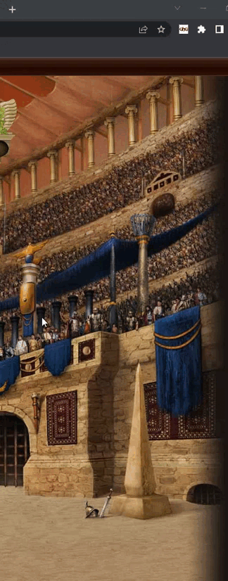

# Gladiatus HealthyGame

Script con atajos y funciones que facilitan la jugabilidad de Gladiatus

### INSTALACIÓN

Para instalar debes descargar la release más reciente:

- Descarga los archivos fuente de la release.
- Descomprime el zip descargado.
- Ve a tu seccion de extensiones del navegador, y selecciona el botón de cargar descomprimida (En chrome).
- Disfruta de la extensión

## Características

- Notificaciones
    
    Se han añadido unas notificaciones en la esquina superior derecha que brindan información de cuantos rotativos puede comprar con el oro que tiene actualmente.
    
    Personalización de los rotativos a notificar

- Paquetes

    Se ha añadido un botón que coloca los objetos al costado del inventario, según una categoría a seleccionar (por defecto Mercado), esto a fin de no tener que buscarlos a lo largo de los demás paquetes, es recomendado utilizar la extensión Crazy Addon y colocar el agrupar paquetes en 10 o más, ya que busca el objeto dentro de los que la página abierta tenga disponibles.
    
    El valor de la categoría se almacena automáticamente.
    
    
    
    Se añadieron atajos rapidos a las diferentes categorias de los paquetes para acceder de manera más rapida
    
     

- Mercado de Alianza

    Se han añadido botones de venta rápida, de manera que al presionar alguno de estos botones se venderá por el precio que esté marcado y seleccionará la duración que se elija.

    Personalización de los precios que aparecerá en el menú. El valor de la duración se almacena automáticamente.
    
    Además se añadio un boton de compra rapida donde comprara el objeto en orden ascendente o descendente segun el valor que tenga.
    
    

   Con la ultima actualizacion del juego se añadieron banderas cerca de los nombres de manera que para una mejor vista    de que puedes comprar y que has vendido cambiamos el color de la columna de los objetos que puedes comprar a verde.

  

- Subasta

    Se ha añadido un botón que comprará todos los alimentos que estén en la página o hasta que no tengas oro lo que suceda primero, no sobrepujará a los aliados pero si a los rivales
    
    

- Fundición

    Se ha añadido una funcionalidad que trabaja de la mano con la extensión Time Saver, lo que hace es fundir todos los objetos que estén en el inventario seleccionado, además también está la función de guardar los recursos y después fundir.
    
     

- Guardar Oro

    Se ha añadido una funcion que permite guardar el oro.

    Guardar oro en entrenamiento.
    Guardar oro en el mercado de la alianza.

- Menu
    
    V1.0.1 Se modifico la forma en como se accede al menu, ahora en vez del boton flotante (intrusivo) en la pantalla del juego, lo movimos a el boton de la extención.
  
    
     

## Feedback

Si deseas reportar errores, dar sugerencias o ideas para implementar, puedes dejar una [Issue en github](https://github.com/lpachecob/Gladiatus-HealthyGame/issues/new), y lo revisaremos.

## Autor

- [@lpachecob](https://github.com/lpachecob)
